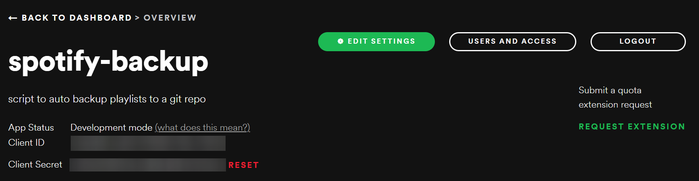
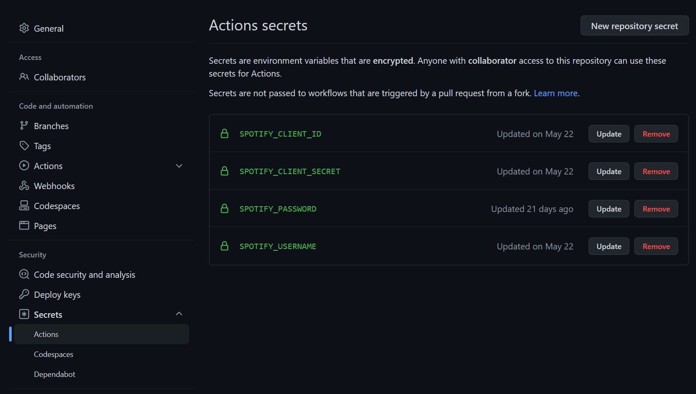

Scheduled Python script to backup your personal Spotify playlists incase the platform ever goes down (or you just like having your data).

## Environemnt Variables

You can get Spotify `CLIENT_ID` and `CLIENT_SECRET` values from setting up your own [Spotify Developer Application](https://developer.spotify.com/dashboard/applications). Make sure `http://localhost:3000/callback` is set as a Redirect URI.




```
# .env file
# Values from your Spotify Developer Application
SPOTIFY_CLIENT_ID=laboriselitutenimdoculpa
SPOTIFY_CLIENT_SECRET=laboriselitutenimdoculpa

# Your Spotify Username
SPOTIFY_USERNAME=12345678910

# Your Spotify Password
SPOTIFY_PASSWORD=abcdefghijklmnopqrstuvwxyz

# Comma separated list of usernames of playlist authors.
# This allows you to back up other peoples playlists (that you follow) if you want.
# if left blank, all of your followed/created playlists will be backed up.
SPOTIFY_OWNER_IDS=snoopdogg,drdre,spotify
```

## Run the script

```cmd
python script.py
```

> Under the hood this is running a headless browser to authenticate your user. Once the access token has been fetched, it is then used to query for your playlists and subsequently the tracks within those playlists.

## Github Action Setup

Before your Github Action will run successfully, you must setup the above `.env` variables correctly within the repo.



Once setup, you can manually run the job via the `Actions` tab.

### Automated CRON Job

By default, the CRON Job Github Action is disabled. To enable this within your repo, open the `.github/workflows/python-app.yml` file and uncomment the schedule code block.

```yaml
on:
  # schedule:
  #   - cron: '0 3 * * 2'
  workflow_dispatch:
    inputs:
      logLevel:
        description: 'Log level'
        required: true
        default: 'warning' 
        type: choice
        options:
        - info
        - warning
        - debug 
```

> You can use the [crontab](https://crontab.guru/) tool to calculate when and how often you want to run the Github Action.